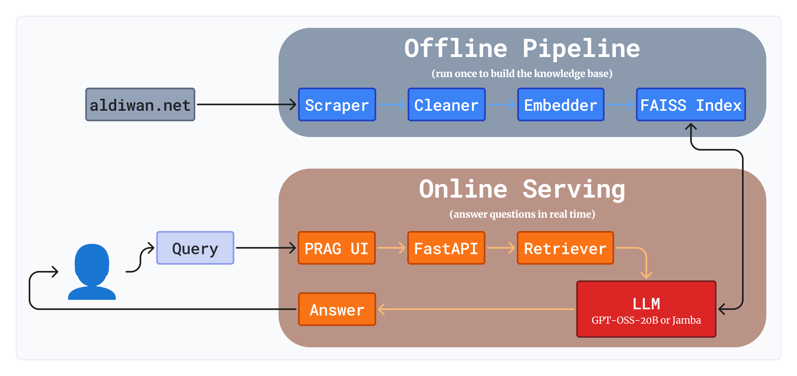

# PRAG — Arabic Poetry RAG

A production-ready local Arabic Poetry RAG system that scrapes data from `aldiwan.net`, and uses LLMs (gpt-oss via Ollama and Jamba via AI21) to answer questions with precise citations.

---

## 🚀 Quick Start

### 1. Setup

```bash
# Clone and enter
git clone https://github.com/your-username/arabic-poetry-rag.git
cd arabic-poetry-rag

# Environment
python -m venv venv
venv\Scripts\activate
pip install -r requirements.txt

# Configure (Add your JAMBA_API_KEY)
cp .env.example .env
```

### 2. Run the Pipeline

1. **Pull local model**: `ollama pull gpt-oss:20b-cloud`
2. **Collect Data**: `python scraper/scrape_aldiwan.py`
3. **Clean & Chunk**: `python preprocessing/clean_and_chunk.py`
4. **Index Embeddings**: `python embeddings/embed_and_index.py`
5. **Start Servers**:
   - Terminal 1: `python api/main.py`
   - Terminal 2: `gradio ui/app.py` (Use `gradio` for auto-reload)
6. **Test**: `python tests/test_pipeline.py`

---

## ✨ Features

- **PRAG Branding**: A premium, minimalist Arabic-first interface with glassmorphism.
- **Unlimited Retrieval**: Optimized automatic high-count retrieval (20+ chunks).
- **Robust Scraper**: Collects poems with titles, poets, eras, and line counts.
- **Enhanced Metadata**: Track word counts and poem lines for better RAG precision.
- **Arabic NLP**: Diacritics removal and normalization via `pyarabic`.
- **Dual LLMs**: Run locally with Ollama (gpt-oss) or via API (Jamba).
- **Test Suite**: Fully automated tests for the entire pipeline.

---

## 🧠 System Deep Dive

### Big Picture

The system works in two phases:



### File-by-File Explanation

#### `scraper/scrape_aldiwan.py` — Data Collection

Crawls aldiwan.net and collects poems by iterating through authors. Extracts `title`, `poet_name`, `era`, `num_lines`, `poem_text`, and `poem_url`.

#### `preprocessing/clean_and_chunk.py` — Arabic NLP

Cleans raw Arabic text (removes tashkeel, normalizes alef/ya) and splits poems into **300-character windows** with **50-character overlap** to ensure context preservation.

#### `embeddings/embed_and_index.py` — Vector DB Builder

Uses `multilingual-e5-small` to convert text chunks into 384-dim vectors. Stores them in a **FAISS** `IndexFlatIP` for exact similarity search.

#### `rag/retriever.py` — Semantic Search

Embeds user questions and searches the FAISS index to find the most relevant poem chunks.

#### `rag/generator.py` — LLM Answer Generation

Builds an Arabic RAG prompt and calls the LLM.

- **gpt-oss**: Local via Ollama.
- **jamba**: Cloud via AI21 API.

#### `api/main.py` — FastAPI Backend

Exposes the pipeline via `/ask`, `/health`, and `/stats`. Supports `top_k` up to **50**.

#### `ui/app.py` — PRAG (Gradio Frontend)

A premium, dark-themed UI featuring glassmorphism, Tajawal typography, and model comparison.

---

## 🛠️ Testing

Run `python tests/test_pipeline.py` to verify every layer of the system.

# Thanks
